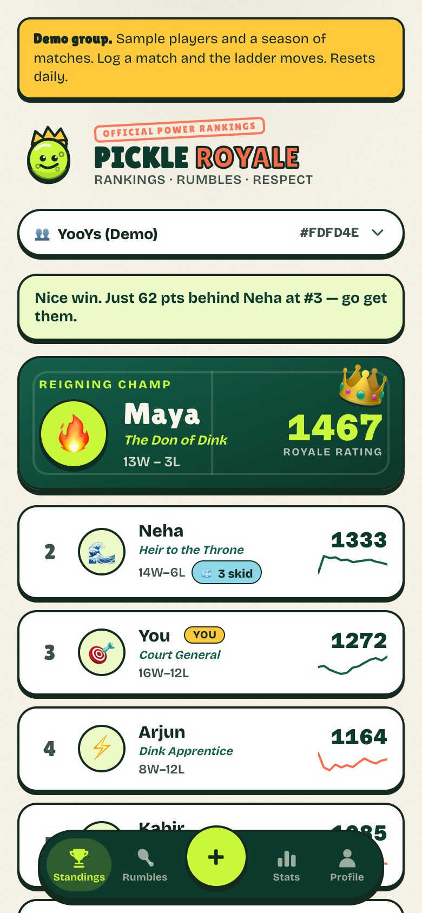
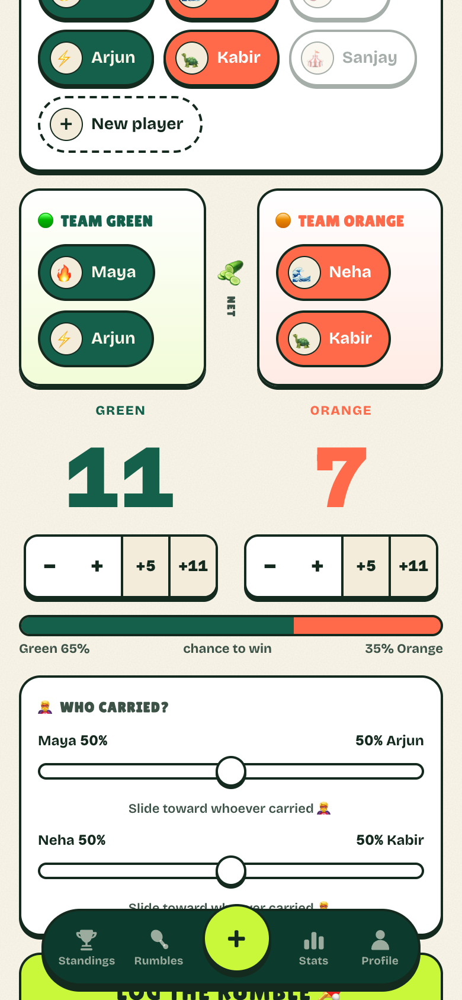
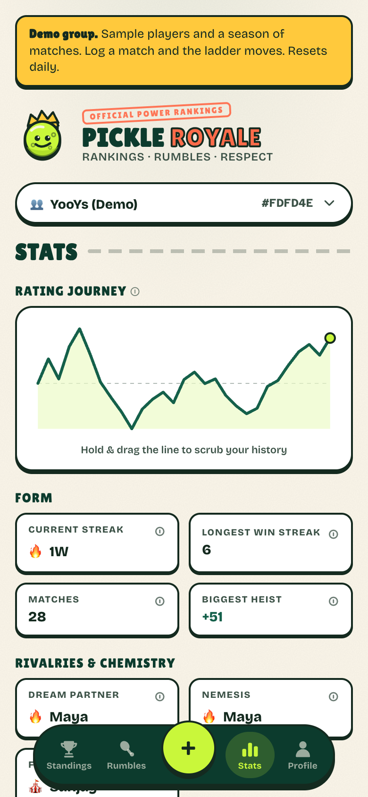

# Pickle Royale

A ladder for the weekly 2v2 pickleball game my friends and I play. Log a match at the court, everyone's rating moves, and the group chat has something to argue about.

**Try it without an account:** https://pickleball.dhrumilkherde.com/demo
(The bare domain asks for Google sign-in. `/demo` gives you a throwaway group with six players and five weeks of matches, and you're the admin.)

<p>
  
  
  
</p>

## Why it exists

We kept score in WhatsApp and nobody agreed on who was actually good. Win counts were useless because the teams change every game, and an 11-9 loss against the two best players says more than an 11-2 win against beginners. So I designed a rating that understands doubles, then built the app around the one moment that matters: standing at the court, sweaty, logging a score in under ten seconds.

## Things worth looking at

**The rating engine** ([`shared/elo.ts`](shared/elo.ts), [docs](docs/ALGORITHM.md))
Team Elo with margin-of-victory scaling, a provisional K-factor for new players, and a "who carried?" split so the stronger partner of a winning pair doesn't get the same credit as the passenger. Ratings are never stored as truth. They are recomputed by replaying the full match log, so editing or deleting an old match can't leave anyone's rating corrupted.

While writing tests I found that the standard margin-of-victory formula has a singularity: at a 2,200-point rating gap its denominator hits zero, and past that it goes negative, which would hand the winner a rating loss. The fix clamps the denominator and caps the multiplier. Both only engage past a ~1,150-point gap, and I confirmed the fix was a no-op for real data by replaying all 48 production matches: every one of the 21 ratings came out identical to 9 decimal places.

**Primitives, not hand-rolled overlays** ([`src/components/ui/Overlay.tsx`](src/components/ui/Overlay.tsx))
Every sheet and modal goes through one `Overlay` primitive composed on [Base UI](https://base-ui.com) Dialog. Base UI owns the behaviour (focus trap, Esc, scroll lock, inert background, labelled titles). The primitive owns our rules: info opens as a bottom sheet, actions as a centered modal, and destructive confirmations are `alertdialog`s that a stray tap on the scrim can't answer, with focus starting on Cancel.

**The score input** ([`src/components/ScoreField.tsx`](src/components/ScoreField.tsx))
The giant score number is the real input, built on Base UI NumberField. Tap it and type 11, or use the arrow keys (Shift for +10). − and + auto-repeat while held. The first version only listened to `pointerdown`, so keyboard users could reach the buttons but nothing happened when they pressed them. Rebuilding on the primitive fixed that class of bug instead of that one bug.

**A design language written down** ([`docs/DESIGN-LANGUAGE.md`](docs/DESIGN-LANGUAGE.md))
2px ink borders, hard offset shadows with zero blur, buttons that press *down into* their shadow instead of lifting, radius that changes with element size, and a mono face reserved for numbers that move (ratings, deltas, scores) while counts of things stay in the display face. The iOS and Android app follows the same spec.

**Identity that matches how groups actually form**
A *player* (a name on a ladder) is separate from a *user* (a Google login). An admin can add friends who never sign up; if they join later they claim their name, either instantly through an invite link or by admin approval. Every API route under `/api/groups/:gid` passes a membership guard, so groups are isolated server-side, not just hidden in the UI.

**Demo mode that cleans up after itself**
Each `/demo` visit mints its own user and a deterministic seeded season (same fixture for every visitor, so the story is stable). A daily cron deletes demo accounts older than 24 hours. Real groups are never touched.

## Stack

React + TypeScript, Vite, Base UI · Hono on Cloudflare Workers · D1 (SQLite) · R2 for weekly backups · installable PWA. No UI kit, no state library.

```
src/            React app (components/ui holds the primitives)
worker/         Hono API: auth, groups, matches, invites, demo, legal pages
shared/         Rating engine + team balancer, used by both sides
migrations/     D1 schema, additive-only
tests/          Engine and balancer tests (vitest)
docs/           Product, architecture, algorithm, decisions, hurdles, design language
```

## Run it locally

```bash
pnpm install
cp .dev.vars.example .dev.vars   # local-only secrets, enables fake login
pnpm run db:local                # create the local D1 database
pnpm build && npx wrangler dev   # http://localhost:8787, open /demo
pnpm check                       # typecheck + tests + build (what CI runs)
```

`pnpm dev` runs Vite alone, which is handy for pure UI work but has no API behind it.

## Docs

The [`docs/`](docs/README.md) folder is the honest record: the [PRD](docs/PRD.md), [architecture](docs/ARCHITECTURE.md), [decisions and their trade-offs](docs/DECISIONS.md), the [hurdles](docs/HURDLES.md) that cost real hours (a Cloudflare SPA handler that silently ate OAuth redirects is a good one), and the [roadmap](docs/ROADMAP.md).

---

Designed and built by [Dhrumil Kherde](https://folio4.dhrumilkherde.com), with Claude Code as the pair.
